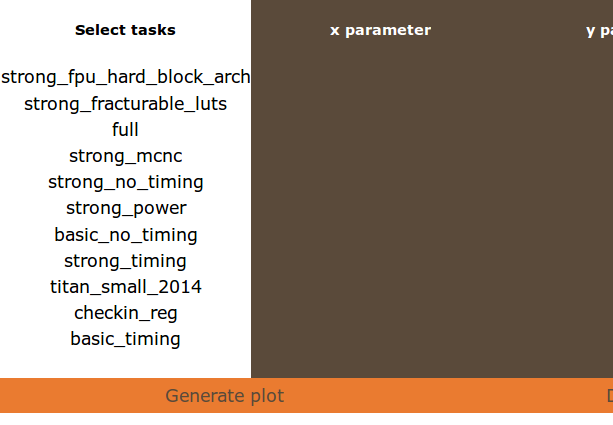
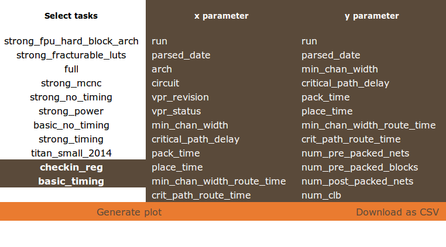
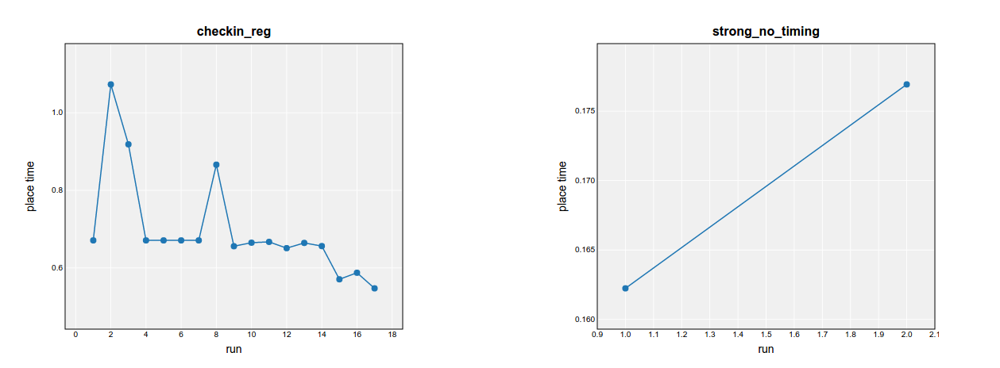
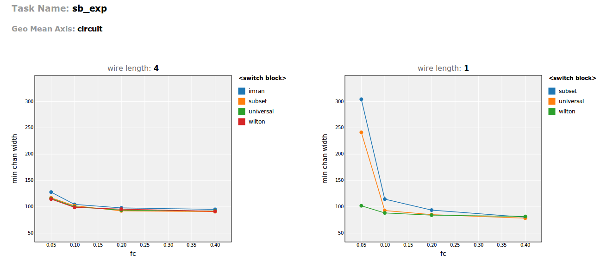
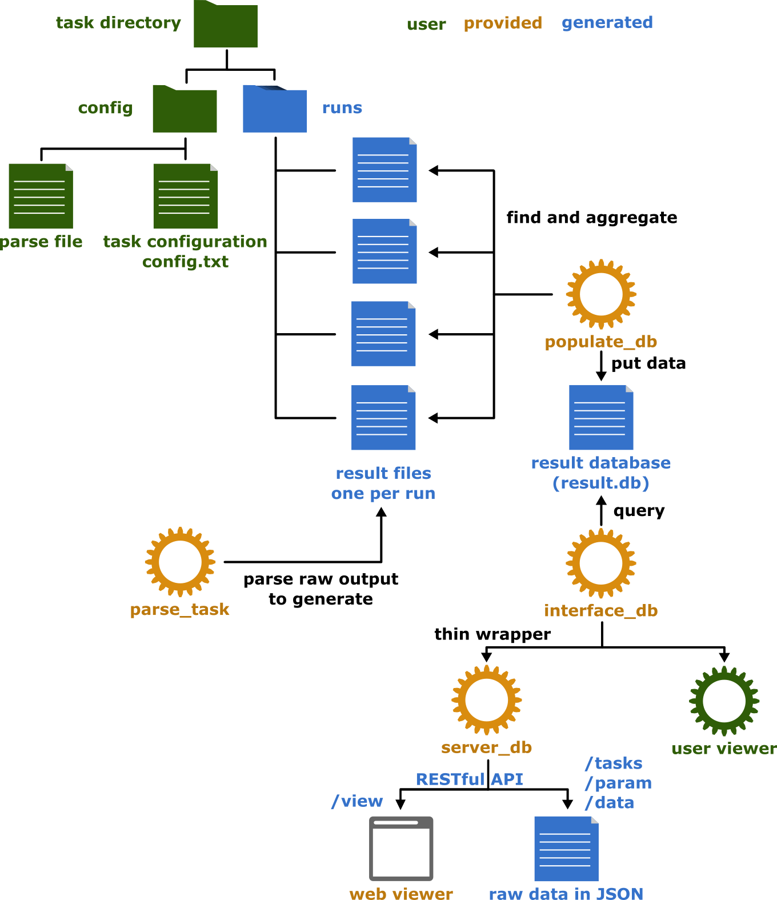

# Benchtracker
Track benchmarks locally and interactively display the results.  
A collection of chained tools are provided to create multiple entry points for different projects.
Your project can enter and exit at any point!

# Get started
(TODO, configure benchtracker into python package and allow people to pip install it)

# Example usage (VTR)
### Basic
Example paths are used instead of placeholders to minimize confusion. Replace
occurances of `~/benchtracker` with your actual benchtracker directory.
A VTR user first runs the task, parses it, then populates the database with it:
```
bash$ cd ~/vtr/vtr_flow/scripts/
scripts$ ./run_vtr_task.pl checkin_reg
scripts$ ./parse_vtr_task.pl checkin_reg
scripts$ ~/benchtracker/populate_db.py ~/vtr/vtr_flow/tasks/checkin_reg -k arch circuit
```
`populate_db.py` arguments:
 1. `~/vtr/vtr_flow/tasks/checkin_reg` required positional argument to the task directory
 2. `-k arch circuit` key parameters that uniquely define a VTR benchmark
 
VTR has its own `run_task` and `parse_task` scripts, so it enters benchtracker at the `populate_db` stage.
`checkin_reg` is the name of the task to task, and it exists as a folder shown below:
```
vtr_flow
    tasks
        checkin_reg
            config
                config.txt
            run1
            run2
            run3
            ...
```

### Calling parse script
A more advanced and safer usage would be to let `populate_db` call the parse script for the runs
that are not parsed yet:
<pre>
bash$ ~/vtr/vtr_flow/scripts/run_vtr_task.pl checkin_reg
bash$ ~/benchtracker/populate_db.py ~/vtr/vtr_flow/tasks/checkin_reg -k arch circuit <b>-s 
"~/vtr/vtr_flow/scripts/parse_vtr_task.pl {task_dir} -run {run_number}"</b>
</pre>

The command string following the `-s` option:
 1. The first item is the script to execute, given such that the shell can find it
 2. Arguments to pass to the script, custom for whichever script was run
 3. `{task_dir}` is replaced in the call with `~/vtr/vtr_flow/tasks/checkin_reg`
 4. `{run_number}` would be replaced with whichever run does not have a parsed results file
 5. `{task_name}` is also available for substitution, `checkin_reg` in this case

### Using task list
A task list (file with name of tasks on separate lines) can be used:
<pre>
bash$ ~/vtr/vtr_flow/scripts/<b>run_vtr_task.pl</b> -l ~/vtr/vtr_flow/tasks/regression_tests/vtr_reg_strong/task_list.txt
bash$ ~/benchtracker/populate_db.py regression_tests/vtr_reg_strong/task_list.txt <b>--root_directory
~/vtr/vtr_flow/tasks/</b> -k arch circuit -s "~/vtr/vtr_flow/scripts/parse_vtr_task.pl {task_dir} -run {run_number}" 
</pre>

Whether a task list or a task directory is given depends on if the given path points to a file or a directory.
`--root_directory` expands all task names in the list with the `~/vtr/vtr_flow/tasks/` prefix. This is
necessary here because the tasks listed in the `task_list.txt` are relative paths from `~/vtr/vtr_flow/tasks/`. 
A consequence of defining `--root_directory` is that the task list name must also be relative to the root directory. 
This is not necessary if the tasks in the list are absolute paths.

The other commands, such as the parse script, remain the same.


## Serving database
Now that the database is populated, the VTR user should host the database so that the online
viewer can be used to visualize the data and for other users to see.
Serving locally is as simple as a call to
```
bash$ ~/benchtracker/server_db.py
```
This is fine if your database is called `results.db` in the `~/benchtracker_data/` directory, and port 5000 is open.

For some common command line options,
```
bash$ ~/benchtracker/server_db.py --root_directory ./ --database testing.db --port 8080
```
 - `--root_directory` tells the server where to find its databases (multiple databases can be served by the same server)
Commandline options and their default values can be found by running `server_db` with `-h`.

### Production serving
The server is configured in debug mode by default, and can be changed to release mode by
changing `server_db.py`'s last line to `app.run(host='0.0.0.0', port=port)`.
The server is then found under the IP address of your machine.

### Specifying database
The syntax for specifying database is the same for `populate_db` and `server_db`:
<pre>
bash$ ~/benchtracker/populate_db.py ~/vtr/vtr_flow/tasks/checkin_reg -k arch circuit <b>-d ~/benchdata/testing.db</b>
bash$ ~/benchtracker/server_db.py <b>-d ~/benchdata/testing.db</b>
</pre>

## Viewing database
Assuming `server_db` is running on port 5000 and has a valid database, the viewer can be 
reached at 
```
http://localhost:5000/view
```
The first box lists the name of the tasks in the served database, and might look like:


Clicking on tasks selects them if they were not selected and unselects them if they were.
Selecting tasks automatically populates the x and y parameter boxes with the tasks' <b>shared parameters</b>:
  
Note that the y-parameter has to be numeric.

The minimum selection for a full query is 1 task, x parameter, and y parameter selected,
with the output options on the dividing row available:


The data can be visualized by generating interactive plots, or downloaded as csv files.
The current selection is saved in query string format by the third button.

## Plot
The plotter is designed to support basic and advanvced usage. 
After clicking the <b>"generating plot"</b> (or <b>"reset plotter"</b>) button, default plots are generated. The policy for generating default plots are as follow:
  - if the `x axis` chosen is related to time (e.g.: `revision number`, `parse date`...), then all the tuples of one single task (regardless of other parameter values) will be reduced into a single (x,y) series, by calculating the geometric mean of the y-axis. 
So the number of resulting plots will equal to number of tasks, and the number of lines in one plot will be 1. 
    - As an example, suppose the raw data before calculating the geometric mean is: 

      | Tasks  | run (`x` axis)  | min channel width (`y` axis)  | fc  | wire length  |
      |:------:|:---------------:|:-----------------------------:|:---:|:------------:|
      | 1      | 1               | 40                            | 0.1 | 1            |
      | 1      | 1               | 70                            | 0.1 | 2            |
      | 1      | 1               | 50                            | 0.4 | 1            |
      | 1      | 1               | 60                            | 0.25| 4            |
      | 1      | 2               | 43                            | 0.1 | 1            |
      | 1      | 2               | 68                            | 0.1 | 2            |
      | 1      | 2               | 51                            | 0.4 | 1            |
      | 1      | 2               | 62                            | 0.25| 4            |
      
      And the resulting data after the geometric mean of this default plotter is:

      | Tasks  | run (`x` axis)  | min channel width (`y` axis)  | fc  | wire length  |
      |:------:|:---------------:|:-----------------------------:|:---:|:------------:|
      | 1      | 1               | 53.84                         | --  | --           |
      | 1      | 2               | 55.14                         | --  | --           |
The below plot is generated when 2 tasks are selected and the `x` axis is `run`:

  - if the x axis chosen is not related to time (e.g.: `fc`, `circuit`...), then the plotter will reduce the data by calculating the geometric mean of y axis, over tuples with the same `x` and other parameters. 
The following tables illustrate the data reduction process:
    - Suppose the raw data is as follow:

      | Tasks  | run  | min channel width (`y` axis)  | fc (`x` axis)  | wire length (`parameter`)  | circuit (`geo mean`)   |
      |:------:|:----:|:-----------------------------:|:--------------:|:--------------------------:|:----------:|
      | 1      | 1    | 70                            | 0.1            | 1            | a.blif     |
      | 1      | 1    | 110                           | 0.1            | 1            | b.blif     |
      | 1      | 1    | 68                            | 0.1            | 2            | a.blif     |
      | 1      | 1    | 107                           | 0.1            | 2            | b.blif     |
      | 1      | 1    | 73                            | 0.1            | 4            | a.blif     |
      | 1      | 1    | 98                            | 0.1            | 4            | b.blif     |
      | 1      | 1    | 60                            | 0.25           | 1            | a.blif     |
      | 1      | 1    | 73                            | 0.25           | 1            | b.blif     |
      | 1      | 1    | 43                            | 0.25           | 2            | a.blif     |
      | 1      | 1    | 88                            | 0.25           | 2            | b.blif     |
      | 1      | 1    | 63                            | 0.25           | 4            | a.blif     |
      | 1      | 1    | 86                            | 0.25           | 4            | b.blif     |
      
    - Then the data after reduction by geometric mean is:
      
      | Tasks  | run  | min channel width (`y` axis)  | fc (`x` axis)  | wire length (`parameter`)  |
      |:------:|:----:|:-----------------------------:|:--------------:|:--------------------------:|
      | 1      | 1    | 87.75                         | 0.1            | 1                          |
      | 1      | 1    | 85.30                         | 0.1            | 2                          |
      | 1      | 1    | 85.58                         | 0.1            | 4                          |
      | 1      | 1    | 66.73                         | 0.25           | 1                          |
      | 1      | 1    | 61.51                         | 0.25           | 2                          |
      | 1      | 1    | 73.61                         | 0.25           | 4                          |
  - After the geometric mean is calculated, a legend is selected such that the resulting number of plots is minimized.
    - The following screenshot shows the resulting plots:


# Definitions
**Task**: A collection of benchmarks that are run together. Is defined by a [`config.txt` file](#config_file) inside `<task_dir>/config/`. Structure should look like:

    task_name
        config
            config.txt
        run1
        run2
        run3
        ...

**Run**: One sweep through the benchmarks defined in a task. 

**Parameter**: A value that either affects or measures the performance of a benchmark.

**Key parameters**: The set of parameters that in combination define a particular benchmark. 
  They are usually input parameters. For example,
  architecture and circuit define a [VTR benchmark](https://code.google.com/p/vtr-verilog-to-routing/), so
  each benchmark is one particular combination of an architecture and a circuit.

**Input parameters**: The set of parameters that affect the performance of a benchmark.
    They are usually the key parameters.

**Output parameters**: The set of parameters that measure the outcome of a benchmark run.
  For example minimum channel width and critical path delay are output parameters of a [VTR benchmark](https://code.google.com/p/vtr-verilog-to-routing/). 

**Axis**: is mainly referred to by the plotter. Basically, the data input to the plotter is stored in a 2D table,
  whose columns are filled in by values of either a parameter or a metric. This table can be transformed into a 
  high dimensional array, with each dimension corresponding to a parameter or a metric. So an axis is a synonym 
  for dimension. In other words, for the plotter, an axis can be a filter, an x or a y.

**Raw**: data is called "raw" if it is not "compressed" or "reduced". Specifically, for the plotter, data is regarded
  as raw if it is not reduced by "gmean" (see the definition below).

**Gmean**: "gmean" is the abbreviations for "geometric mean". For example, in the VTR experiment, if the metric in 
  interest (i.e.: y axis) is minimum channel width, then the "gmean" operation over "circuits" will merge the
  circuit axis by calculating the geometric mean of all circuits' minimum channel width.

**Line Series**: in the plotter, if you choose a parameter to be a line series, 
then a different line will be produced for each distinct value of that parameter on each plot.

# Tools
Each tool has usage information and additional options found by running them with `-h`. **It is highly recommended those be consulted**. The documentation here will only present the overall flow (pictured below), see command line help for detailed usage of each tool.  



Listed in order that they should be run:

(TODO) run_task.py: 
 - preconditions: 
    - task-run structure
 - inputs: 
    - task directory (relative or absolute path to it)
 - actions:
    - runs the user script specified in the configuration file and creates the next run directory
    - create subdirectories for all key parameters, with each level being one key parameter
 - outputs:
    - raw output files in the deepest subdirectories
  
(TODO) parse_task.py:
 - preconditions:
    - task-run structure
    - output files under each run
 - inputs:
    - task directory
    - a [**user specified parse file**](#parse_file) which can be optionally defined in the configuration file
 - actions:
    - tries to match regex corresponding to parameters in the parse file in the relevant output file
 - outputs:
    - a [**result file**](#result_file), defaulting to `parsed_results.txt` in the run's root directory
  
populate_db.py:
  - preconditions:
    - task-run structure
  - inputs:
    - task directory
  - actions:
    - creates a SQLite database (defaults to `results.db`) if it does not exist
    - creates a table for the input task if it does not exist (table name is `<task_name>|<host_name>|<user_name>|<abs_path>`)
    - populate the table with all runs of that task, ignoring existing runs
  - outputs:
    - updates database
     
interface_db.py:
  - preconditions:
    - none
  - inputs:
    - database name
    - task names
    - filters
    - x and y parameters
  - actions:
    - defines a library of python functions to query into database
    - defines `Task_filter` class
  - outputs:
    - none

server_db.py:
  - preconditions:
    - none
  - inputs:
    - database name
  - actions:
    - creates a WSGI web service to be either hosted locally or publically (see [instructions](#public_hosting))
    - renders the viewer template for a web interface into the database
  - outputs:
    - web API for querying into database with query string as arguments
      - arguments: t = tasks, p = parameter, m = mode, fp = filtered parameter, fm = filter method, fa = filter argument,
      x = x paramter, y = y parameter
      - list tasks `/`, `/tasks` ()
      - describe parameter `/param` (t,p,m)
      - retieve data `/data` (t,x,y,[fp,fm,fa]...)
    - web viewer and plotter for GUI into database under `/view`, the online plotter is quite similar with the offline
      one, in terms of functionality (see plotter-offline.py).

plotter-offline.py:
  - preconditions:
    - in the same dir with interface_db.py
  - inputs:
    - data table with x and y axis specified, overlay axes, gmean axes
  - actions:
    - calculates the geometric mean of y axis over the gmean axes
    - generates plots with the input x, y axis. The legend is given by the input overlay axes.
    - user can choose whether to display the plot of the gmean data or the raw data.
    - the plot will ignore the data points with invalid value, and do interpolation (when calculating gmean,
      the invalid value will also be picked out)
  - outputs:
    - the resulting plot

<a name="config_file"> </a>
# Task Configuration File
The format of each line should be `<parameter_name>=<parameter_value>`.  
Lines beginning in '#' are treated as comments.

Parameters include:
 - user_script:
 - script_params
 - key_param:
 - key_param_dir:
 - key_param_add:
 - parse_file:
 
<a name="parse_file"> </a>
# Parse File
The format of each line should be  
`<parameter_name>;<output_file>;<regex>;<default_value>`  
where the regex should have one capture group, the match of which becomes the value of the parameter. 
The default value is optional, defaulting to "-1" if not specified. If nothing is matched, then
the parameter will have the default value.

<a name="result_file"> </a>
# Result File
Each item on every line should end in a tab. This includes the last element.  
The first line is the header with all the parameter names.
N lines follow, where N=number of benchmarks for that task. 
On each line is the value of each parameter for that benchmark.


<a name="public_hosting"> </a>
# Public Hosting Instructions
At the bottom of `server_db.py`, change the call of the run() method to:
`app.run(host='0.0.0.0')` for the server to be visible via your machine's public IP.
